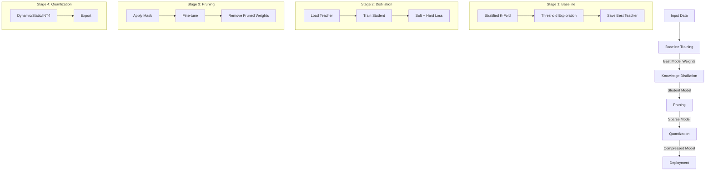

# Detailed Framework Guide: Bangla Hate Speech Compression

This document provides a comprehensive technical overview of the compression framework integrated into the `Finetune-Bangla-BERT-on-Bangla-HateSpeech-Data` project.

## 1. Architecture Overview

The framework implements a sequential compression pipeline designed to reduce model size and inference latency while maintaining accuracy.

## 2. Component Deep Dive

### 📚 Stage 1: Baseline Training (The Teacher)
- **Goal**: Create a high-performance "Teacher" model to guide the smaller student.
- **Model**: `sagorsarker/bangla-bert-base` (BERT-based).
- **Methodology**:
    - **Stratified K-Fold Cross-Validation**: Ensures the model is robust across different data splits (default: 5 folds).
    - **Threshold Exploration**: Instead of a fixed 0.5 threshold, the system dynamically finds the optimal decision threshold (e.g., 0.35 or 0.6) for the F1 score.
    - **Artifact**: The best-performing model across all folds is saved as `best_model_*.pt`.

### 🎓 Stage 2: Knowledge Distillation (KD)
- **Goal**: Transfer knowledge from the large Teacher to a smaller Student.
- **Student Model**: `distilbert-base-multilingual-cased` (40% smaller than BERT).
- **Loss Function**: `Total Loss = (alpha * Soft_Loss) + ((1-alpha) * Hard_Loss)`
    - **Soft Loss**: KL Divergence / MSE between Teacher and Student logits (softened by Temperature `T`). Captures "dark knowledge" (e.g., which classes are similar).
    - **Hard Loss**: Standard Cross-Entropy against true labels.
- **Key Parameters**:
    - `kd_alpha` (0.7): High weight on soft targets usually works better.
    - `kd_temperature` (4.0): Higher T produces softer probability distributions.

### ✂️ Stage 3: Pruning
- **Goal**: Remove redundant weights to create a sparse model.
- **Methods**:
    - **Magnitude Pruning**: Removes weights with the smallest absolute values (simple, effective).
    - **WANDA (Pruning by Weights and Activations)**: Advanced method that considers input activations to decide which weights are important.
    - **Gradual Pruning**: Slowly increases sparsity over training steps (cubic schedule).
- **Fine-tuning**: Essential! After cutting weights, the model is retrained ("healed") for a few epochs to recover accuracy.
- **Permanent Pruning**: Before moving to the next stage, masks are applied permanently, and zeroed weights are effectively removed from the computation graph.

### 📉 Stage 4: Quantization
- **Goal**: Reduce precision of weights/activations (e.g., 32-bit float -> 8-bit integer).
- **Methods**:
    - **Dynamic Quantization (INT8)**: Weights are quantized ahead of time; activations are quantized on-the-fly. Best for CPU inference.
    - **Static Quantization (INT8)**: Both weights and activations are pre-quantized using calibration data. Faster but requires a calibration step.
    - **INT4 (4-bit)**: Extreme compression using `bitsandbytes`. Great for memory reduction but requires GPU.
    - **FP16**: Half-precision. Native speedup on modern GPUs (Tensor Cores).

## 3. Configuration Reference (`src/config.py`)

### Pipeline Control
| Argument | Description |
| :--- | :--- |
| `--pipeline` | Selects the mode: `baseline`, `baseline_kd`, `baseline_kd_prune_quant`, etc. |

### Training & Optimization
| Argument | Default | Impact |
| :--- | :--- | :--- |
| `--batch` | 32 | Higher = faster but more VRAM. |
| `--lr` | 2e-5 | Lower is safer for fine-tuning. |
| `--epochs` | 15 | Max epochs (early stopping will likely cut this short). |
| `--num_folds` | 5 | More folds = more robust evaluation but slower. |

### Compression Specifics
| Argument | Default | Impact |
| :--- | :--- | :--- |
| `--kd_alpha` | 0.7 | Balance between mimicking teacher (1.0) and learning truth (0.0). |
| `--prune_sparsity` | 0.5 | 0.5 means 50% of weights are zeroed. |
| `--prune_method` | `magnitude` | `wanda` is better for high sparsity (>60%). |
| `--quant_method` | `dynamic` | Use `static` for max CPU speed, `int4` for max size reduction. |

## 4. Output Artifacts

All outputs are saved to the `outputs/` directory.

| File/Directory | Description |
| :--- | :--- |
| `best_model_*.pt` | The saved state dictionary of the best Teacher model. |
| `pipeline_summary_*.csv` | A table comparing metrics (Accuracy, F1, Size) across all stages. |
| `final_quantized_pruned_student/` | The final deployable model directory (HuggingFace format: `config.json`, `model.safetensors`, `tokenizer.json`). |
| `fold_summary_*.csv` | Detailed metrics for each fold of the baseline training. |
| `mlruns/` | MLflow logs (view with `mlflow ui`). |

## 5. Troubleshooting Common Issues

- **CUDA Out of Memory**:
    - Reduce `--batch` (try 16 or 8).
    - Use `--quant_method int4` or `--quant_method fp16`.
- **Low Accuracy after Pruning**:
    - Ensure `--fine_tune_after_prune` is enabled.
    - Increase `--fine_tune_epochs`.
    - Reduce `--prune_sparsity` (try 0.3 or 0.4).
- **Quantization Error**:
    - Dynamic/Static INT8 quantization is **CPU only** in PyTorch. The pipeline handles this, but ensure you evaluate on CPU if manually loading.
